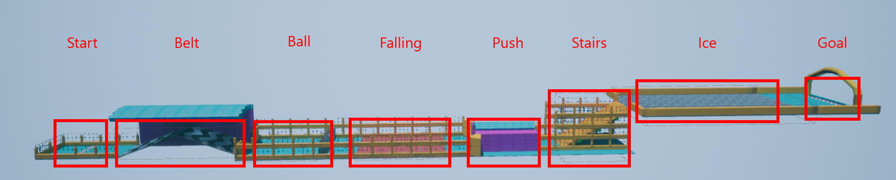

# VrLocomotion
“A Novel Approach for Virtual Locomotion Gesture Classification: Self-Teaching Vision Transformer for a Carpet-Type Tactile Sensor,” IEEE International Symposium on Mixed and Augmented Reality Adjunct (ISMAR-Adjunct), 2023 [[PDF]](https://github.com/Tab4Space/VrLocomotion/blob/main/A_Novel_Approach_for_Virtual_Locomotion_Gesture_Classification.pdf)

### 프로젝트 개요
1. 프로젝트 기간: 2022. 01 ~ 2022. 02
2. 개발 도구 및 개발 환경:  
      

3. 참여 인원: 5인
4. 프로젝트 내에서 나의 역할
    - Oculus Quest 2에서 체험 가능한 VR 게임 개발 (UE 4.26, Blueprint 기반)
    - 센서 처리 프로세스(Python)와 VR 게임(UE4) 간의 통신 인터페이스 개발
 

### 프로젝트 세부내용
해당 연구에서 전도성 천을 사용해 제작한 카펫 형태의 Tac-tile 센서 위에서 행동하는 사용자의 움직임을 예측하고 이를 VR 게임에 반영하는 연구 및 실험을 진행했습니다. 센서 프로세스에서 사용자의 움직임을 총 7가지(marching, running, sitting, sliding, sneaking, standing, walking)로 구분하고 이외에도 이동 방향과 이동 속도를 추론합니다. 추론된 값은 UDP 소켓을 사용해 VR 프로세스에게 전달하고 VR 프로세스는 수신한 값을 버퍼에 채운 후 캐릭터 움직임 및 이동에 사용합니다. 사용자는 Start 지점에서 출발하여 Goal 지점까지 가는 도중 각 구역에서 알맞은 행동을 취하며, 최단 시간 내에 Goal 지점에 도착함을 목표로 합니다. 개발 내용을 바탕으로 사용자 테스트를 진행했으며, 결과를 분석 후 논문으로 작성해 해외 컨퍼런스 한 편을 게재했습니다.
 

**1. 캐릭터 구현**

**2. Map 구현**
- 맵은 약 250m 길이로 사용자는 Start 지점에서 Goal 지점까지 최단 시간 내에 도착하는 것이 목표
- 시작과 목표 지점 사이에서 사용자의 이동에 영향을 주는 6개 구간 구현 및 배치

 

* Belt 구역은 사용자의 움직임이 없는 경우 뒤로 밀려나기 때문에 지속적임 움직임을 요구

 

* Ball 구역은 캐릭터를 뒤로 밀어버리는 공이 발사되므로 공을 피하면서 움직임을 요구

 

* Falling 구역은 사용자의 움직임이 Sneaking으로 구분될때 이동되도록 구현

 

* Push 구역은 캐릭터가 기둥에 맞으면 Push 시작 구간으로 이동되므로 기둥에 맞지 않도록 않아서 기둥을 피하는 움직임을 요구

 

* Stairs 구역은 사용자의 움직임이 Marching으로 구분될때 이동되도록 구현

 

* Ice 구역은 사용자의 움직임이 Sliding으로 구분될 때 이동되도록 구현

 

### UE4 프로젝트 링크
[Google Drive](https://drive.google.com/file/d/1l_EqnK3zK1KyeOUz5AMCwYydsCXbd-Tm/view?usp=drive_link)
 

### 데모 영상
[youtube link](https://youtu.be/hwEnQJO9jr8)